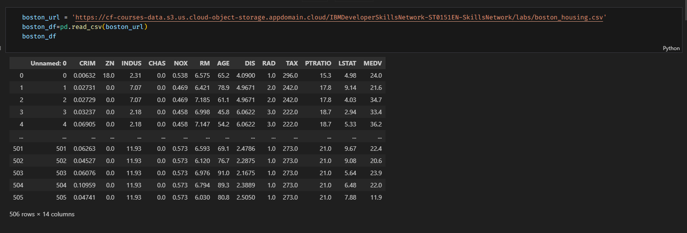
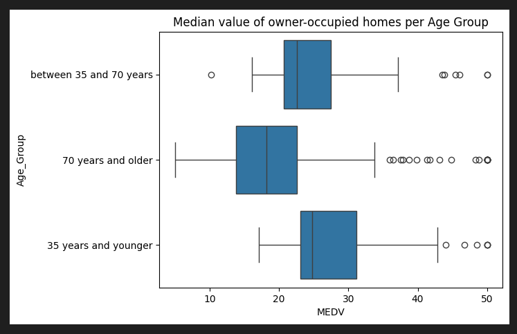
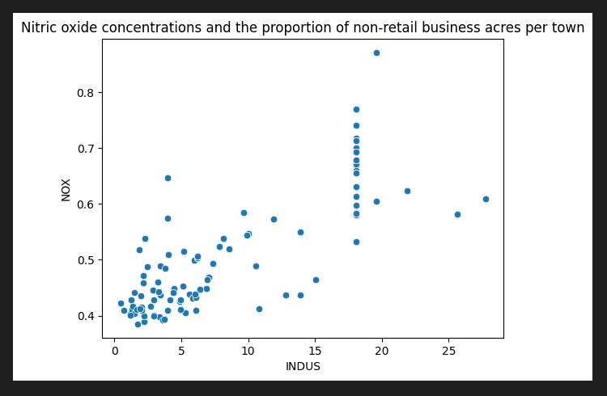
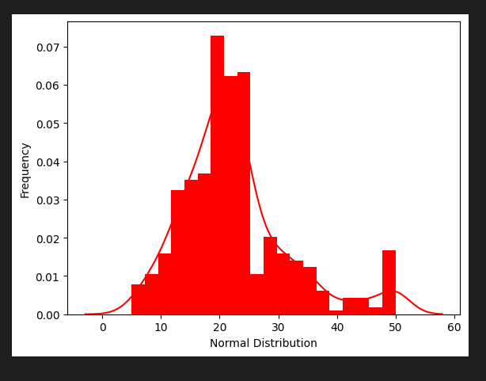
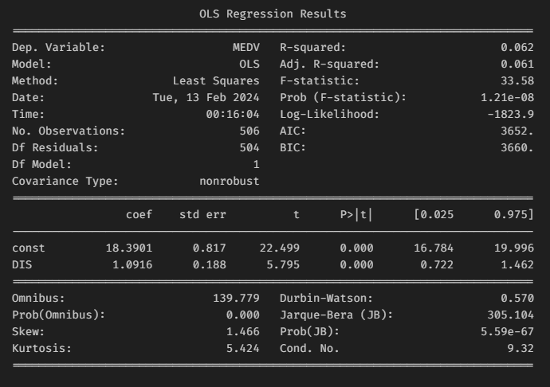
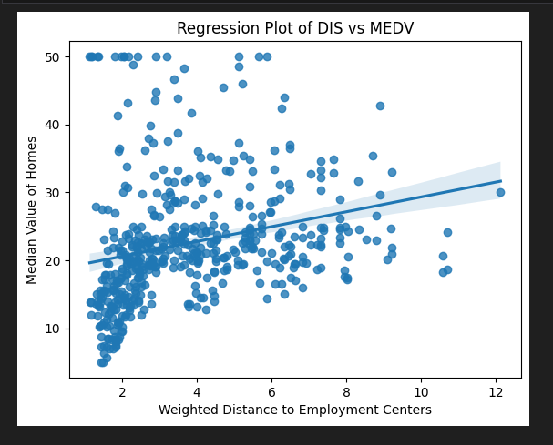

# Final Jupyter Lab Boston Housing Project Analysis

 
 
 

Dataset Source Values
 

 

Median Value by Ages
 

 

Nitric Oxide Concentrations
 

 

Median Value by Charles River
 

 

Regression Results
 

 

Regression Plot
 

 

## *Contact Me*

<h3>Email:&emsp;<a href="mailto:jk377y@gmail.com" target="_blank">jk377y@gmail.com</a></h3>
<h3>Portfolio:&emsp;<a href="https://jk377y.dev" target="_blank">https://jk377y.dev</a></h3>
<h3>LinkedIn:&emsp;<a href="https://www.linkedin.com/in/james-kelly-software-developer/" target="_blank">https://www.linkedin.com/in/james-kelly-software-developer/</a></h3>
<h3>GitHub:&emsp;<a href="https://github.com/jk377y" target="_blank">https://github.com/jk377y</a></h3>
 

## *License*

 Copyright (c) 2024 James Kelly
 Information on this license can be found at: (https://opensource.org/licenses/MIT)
 